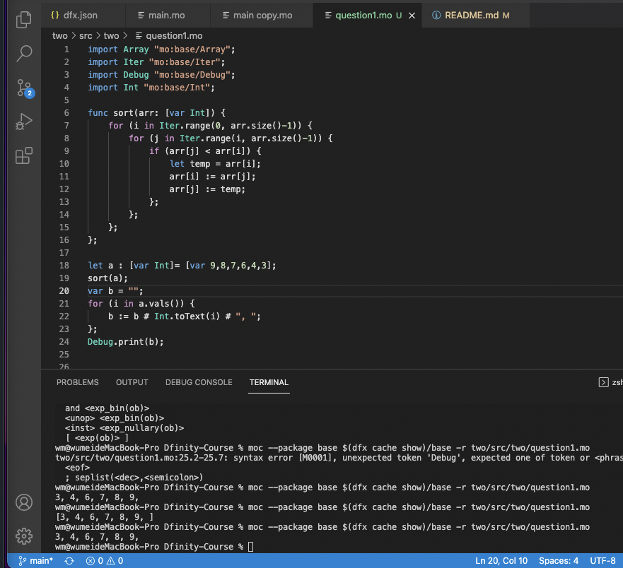

# two

1. 用 moc 调试运行。
源码地址：

https://github.com/wm5713/Dfinity-Course/blob/main/two/src/two/question1.mo

截图：


2. 源码地址：

https://github.com/wm5713/Dfinity-Course/blob/main/two/src/two/main.mo

本地测试结果：
```sh
dfx canister call two qsort '(vec {5:int;32423:int;2652345:int;563455:int;1234:int;74554:int;3:int;444:int;66:int;888:int;222:int;-10000:int;-1022030300303432423423423423423423423423423423423423423423423423423424234234235345453:int;})'
(
  vec { -1_022_030_300_303_432_423_423_423_423_423_423_423_423_423_423_423_423_423_423_423_423_423_424_234_234_235_345_453 : int; -10_000 : int; 3 : int; 5 : int; 66 : int; 222 : int; 444 : int; 888 : int; 1_234 : int; 32_423 : int; 74_554 : int; 563_455 : int; 2_652_345 : int;},
)
```


3. 主网调试地址

https://a4gq6-oaaaa-aaaab-qaa4q-cai.raw.ic0.app/?id=zai2x-yiaaa-aaaah-aa6na-cai

主网测试结果：
